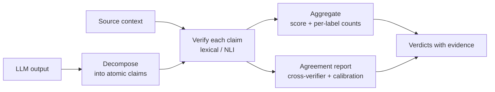

# syntony

Offline, traceable grounding and faithfulness verifier for LLM outputs.

syntony takes an LLM output and the source context it was supposed to be
grounded in, breaks the output into atomic claims, and checks each claim
against the context. Every claim gets a verdict (`supported`, `contradicted`,
or `unsupported`) and the concrete source span that justifies it. The result is
a faithfulness score you can gate on and a per-claim audit trail you can inspect.

## Why it exists

Existing faithfulness tools (RAGAS, DeepEval, TruLens) lean on a hosted LLM to
act as judge. That couples your evaluation to a network call, a moving model,
and a verdict you cannot reproduce or fully explain. syntony fills a different
gap:

- **Offline by default.** The core install and the lexical verifier need no
  network and no model download. They run in an air-gapped environment.
- **Traceable and reproducible.** Every verdict carries the evidence span that
  produced it. The deterministic verifier gives the same answer every time.
- **No black-box judge.** The baseline is a transparent lexical check you can
  read and reason about. The optional NLI backend runs a local model, not a
  remote API.
- **Built for regulated settings.** Healthcare and finance need verdicts that
  can be audited after the fact. That constraint shaped the data model: a
  positive or negative verdict without its evidence is unrepresentable.

It is the LLM-domain counterpart to a leakage-free validation framework for
classical models: the point is a result you can trust and defend, not a number
from an opaque oracle.

## How it works



## Install

```bash
pip install syntony            # core, fully offline
pip install 'syntony[nli]'     # adds the local NLI backend (transformers, torch)
```

## Quickstart

```bash
# 1. Verify a case and see per-claim verdicts with evidence
syntony examples/sample_evalcase.json

# 2. Use it as a CI grounding gate (non-zero exit if score < 0.8)
syntony examples/sample_evalcase.json --fail-under 0.8

# 3. Compare the lexical and NLI verifiers and surface disagreements
syntony examples/sample_evalcase.json --agreement
```

## In code

```python
from syntony import EvalCase, LexicalVerifier, evaluate

case = EvalCase(
    output_text="The drug reduced mortality. The treatment cured all patients.",
    source_context="The drug reduced mortality by 30 percent versus placebo.",
)

result = evaluate(case, LexicalVerifier())

print(result.faithfulness_score)   # 0.5
print(result.counts)               # {'supported': 1, 'contradicted': 0, 'unsupported': 1}

for verdict in result.claims:
    print(verdict.label, verdict.claim)
    for evidence in verdict.evidence:
        print("   ", evidence.source_span)
```

## The three labels

| Label          | Meaning                            | Typical cause                          |
| -------------- | ---------------------------------- | -------------------------------------- |
| `supported`    | The context entails the claim.     | Correctly grounded output.             |
| `contradicted` | The context refutes the claim.     | Output disagrees with a known source.  |
| `unsupported`  | The context is silent on the claim.| Hallucination or a retrieval miss.     |

`contradicted` and `unsupported` are never merged. They are different failures
and call for different fixes (fix the model versus fix the retrieval), so
syntony reports them separately everywhere.

## Verifiers

- **Lexical** (default, offline): content-word overlap with negation-aware
  contradiction detection. Deterministic and transparent. The reproducible
  baseline.
- **NLI** (`syntony[nli]`): a local natural-language-inference model that
  handles paraphrase and subtler contradiction. Loads lazily, runs on CPU, and
  fails loudly rather than falling back silently.

Run both and trust the agreement: where a deterministic check and a semantic
model disagree, a human should look. See [docs/verifiers.md](docs/verifiers.md).

## CI gating

`--fail-under THRESHOLD` exits non-zero when faithfulness drops below the
threshold, with documented exit codes that separate a real below-threshold
result from an infrastructure failure. See [docs/ci_gating.md](docs/ci_gating.md).

## Documentation

- [Concepts](docs/concepts.md): the claim / verdict / evidence model and why
  three labels.
- [Verifiers](docs/verifiers.md): how each verifier works, tradeoffs, when to
  use which.
- [CI gating](docs/ci_gating.md): using `--fail-under` in a pipeline.

## License

MIT. See [LICENSE](LICENSE).
